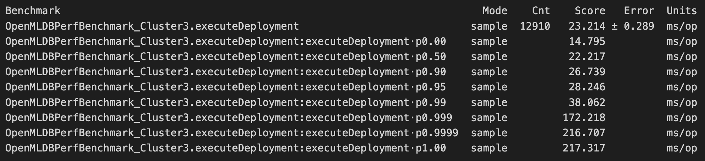
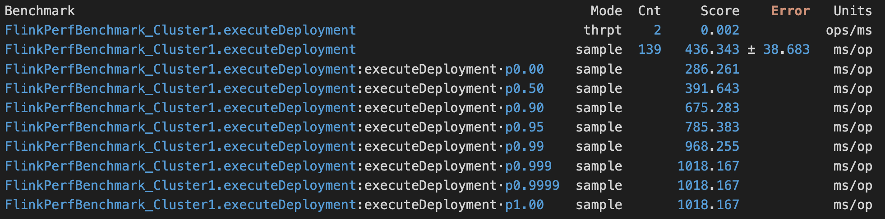

<div align="center">

-----
A Benchmark for Real-Time Relational Data Feature Extraction.

[**What is FEBench?**](#-what-is-febench)
| [**Data and Query**](#-data-and-query)
| [**Getting Started**](#%EF%B8%8F-quickstart)
| [**Contributing**](#%EF%B8%8F-contributing)
</div>

## Community

We deeply appreciate the invaluable effort contributed by our dedicated team of developers, supportive users, and esteemed industry partners.

- [National University of Singapore](https://nus.edu.sg/)
- [Tsinghua University](https://www.tsinghua.edu.cn/en/)
- [4Paradigm](https://en.4paradigm.com/index.html)
- [OpenMLDB](https://github.com/4paradigm/OpenMLDB)
- [Apache Flink](https://flink.apache.org/)
- [Intel](https://www.intel.com/)

## 💡 What is FEBench?

As online AI inference services have been rapidly deployed in many emerging applications such as fraud detection and recommendation, we have witnessed various systems developed for real-time feature extraction (RTFE) to compute real-time features over incoming new data tuples. Also, the RTFE procedures can be expressed in SQL like languages. 

However, there is no any study about the workload characteristics and benchmarks for RTFE, specifically in comparison with existing database workloads and benchmarks (such as TPC-C). Thus, we have cooperated with our industry partners and built a real-time feature extraction benchmark named FEBench. FEBench consists of selected datasets, query templates, and testing framework. We utilize FEBench to investigate the effectiveness of feature extraction systems and find all the tested systems (e.g., Flink, OpenMLDB) have their own problems in different aspects (e.g., overall latency, tail latency, and concurrency performance). 

See the detailed [technical report](https://github.com/decis-bench/febench/blob/main/report/febench.pdf) and [Standard Specification](https://github.com/decis-bench/febench/blob/main/report/Feature_Extraction_Benchmark_Standard_Specification.pdf)!

<span id="-data-and-query"></span>
## &#x1F4DC;  Data and Query

We have conducted an analysis of both the schema of our datasets and the characteristics of the queries. Please refer to our detailed [data schema analysis](https://github.com/decis-bench/febench/blob/main/report/tableSchema.md) and [query analysis](https://github.com/decis-bench/febench/blob/main/report/queryAnalysis.md) for further information.

## ⚡️ Quickstart

This repository includes the following parts: (1) AI features, (2) OpenMLDB evaluation, (3) Flink evaluation.

### Part 1 (AI Features)

In the *features* folder: Check out the features utilized in each of the 6 AI tasks, which are generated by the commercial automated ML tool [HCML](https://en.4paradigm.com/product/hypercycle_ml.html) (the simplified version is available at *https://github.com/4paradigm/AutoX*).

### Part 2 (OpenMLDB Evaluation)

Step 1: Clone the repository

Step 2: Download the datasets and move the data files to the dataset directory

  ```sh
  wget -r -np -R "index.html*"  -nH --cut-dirs=3  http://43.138.115.238/download/febench/data/  -P ./dataset
  ```

> Note the data files are in parquet format.

Note that, the above server is located in China, if you are experiencing slow connection, you may try to download from OneDrive (this copy is compressed, please decompress after downloading): https://1drv.ms/f/s!At2bMwG7v7Dngbg21F0ELbZrhC7NBA?e=atHwQy

Step 3: [Start the cluster](https://openmldb.ai/docs/zh/main/deploy/install_deploy.html) and enter the `./OpenMLDB` folder in this project. For a quick start, you can use the [docker](https://openmldb.ai/docs/zh/main/quickstart/openmldb_quickstart.html#id4), but note that the performance may not be optimal since all the components are deployed on a single physical machine.
> Please be aware that the default values for `spark.driver.memory` and `spark.executor.memory` may not be enough for your needs. If you encounter a `java.lang.OutOfMemoryError: Java heap space` error, you may need to increase them. You can refer to [this document](https://openmldb.ai/docs/zh/main/maintain/faq.html#java-lang-outofmemoryerror-java-heap-space) for guidance. One acceptable size for these parameters is 32G/32G.

Step 4: Please modify the `conf.properties.template` file to create your own `conf.properties` file in the `./conf` directory, and update the configuration settings in the file accordingly, including the OpenMLDB cluster and the locations of data and queries. 

```sh
export FEBENCH_ROOT=`pwd`
sed s#\<path\>#$FEBENCH_ROOT# ./OpenMLDB/conf/conf.properties.template > ./OpenMLDB/conf/conf.properties
sed s#\<path\>#$FEBENCH_ROOT# ./flink/conf/conf.properties.template > ./flink/conf/conf.properties
```


  ```sh
DATASET_ID=5   # set by compile_test.sh/test.sh
DATASET_NUM=6
...

HOST=127.0.0.1:xxxx
...

DATABASE_C3=q3_db
DEPLOY_NAME_C3=q3_db_service
DATA_FOLDER_C3=<path>/dataset/Q3/
DEPLOY_SQL_C3=<path>/OpenMLDB/fequery/Q3/Q3_deploy_benchmark.sql
CREATE_SQL_C3=<path>/OpenMLDB/fequery/Q3/Q3_create_benchmark.sql
DROP_SQL_C3=<path>/OpenMLDB/fequery/Q3/Q3_drop_benchmark.sql
...

  ```


Step 5: Run the testing script

5.1 Run the compile_test.sh file (for the first time),

```bash
./compile_test.sh <dataset_ID>
```

5.2 Otherwise,

```bash
./test.sh <dataset_ID>
```




### Part 3 (Flink Evaluation)

Repeat the 1-5 steps in *OpenMLDB Evaluation*. And there are a few new issues:

1. In Step 3, additionally start a disk-based storage engine (e.g., RocksDB in MySQL) to persist the Flink table data. Note (1) the listening port is set 3306 by default and (2) you need to preload all the secondary tables into the storage engine.

2. In Step 5, indicate the <dataset_ID> when running the *compile_test.sh* script; and no parameter when running *test.sh*, e.g., 

```bash
./compile_test.sh 3 // compile and run the test of task3
./test.sh // rerun the test of task3
```
3. You need to rerun compile_test.sh if you modify the conf.properties. This is not needed for *OpenMLDB Evaluation*.



## Citation

If you use FEBench in your research, please cite:

```bibtex
@article{zhou2023febench,
  author       = {Xuanhe Zhou and 
                  Cheng Chen and
                  Kunyi Li and
                  Bingsheng He and
                  Mian Lu and
                  Qiaosheng Liu and
                  Wei Huang and
                  Guoliang Li and
                  Zhao Zheng and
                  Yuqqiang Chen},
  title        = {FEBench: A Benchmark for Real-Time Relational Data Feature Extraction},
  journal      = {Proc. {VLDB} Endow.},
  year         = {2023}
}
```

## ✉️ Contributing
FEBench is developed as an open platform to attract industry and academia to collaborate on the benchmark and further development of RTFE. Please leave your comments in the [Issues](https://github.com/decis-bench/febench/issues) if you would like to get involved or contribute!
