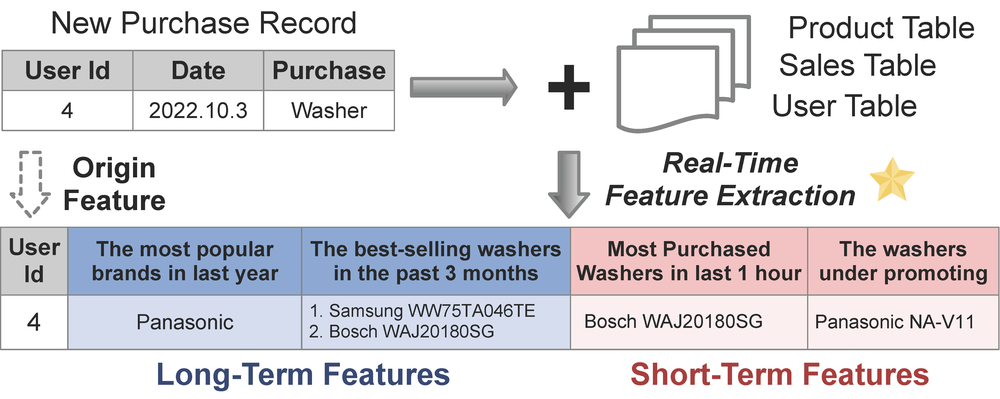

<div align= "center">
    <h1> FEBench: A Benchmark for Real-Time Feature Extraction</h1>
</div>


<p align="center">
  <a href="#-leaderboard">Leaderboard</a> •
  <a href="#-data-and-query">Data and Query</a> •
  <a href="#-quickstart">QuickStart</a> •
  <a href="#-result-uploading">Result Uploading</a> •
  <a href="#-contact">Contact</a>
</p>


<br>

<div align="center">

</div>


<br>


🧗 FEBench is a novel benchmark specifically designed for real-time feature extraction (RTFE) within the domain of online AI inference services. These services are rapidly being deployed in diverse applications, including *finance, retail, manufacturing, energy, media, and more.*

  Despite the emergence of various RTFE systems capable of processing incoming data tuples using SQL-like languages, there remains a noticeable lack of studies on workload characteristics and benchmarks for RTFE.

  In close collaboration with our industry partners, FEBench addresses this gap by providing *selected datasets*, *query templates*, and a comprehensive *testing framework*, which signifcantly differs from existing database workloads and benchmarks like TPC-C.

👐 With FEBench, we preliminarily investigate the effectiveness of feature extraction systems together with advanced hardwares, focusing on aspects like overall latency, tail latency, and concurrency performance.

For further insights, please check out our detailed [Technical Report](report/febench.pdf) and [Standard Specification](report/Feature_Extraction_Benchmark_Standard_Specification.pdf)!

## 👫 Community

We deeply appreciate the invaluable effort contributed by our dedicated team of developers, supportive users, and esteemed industry partners.

- [National University of Singapore](https://nus.edu.sg/)
- [Tsinghua University](https://www.tsinghua.edu.cn/en/)
- [4Paradigm](https://en.4paradigm.com/index.html)
- [OpenMLDB](https://github.com/4paradigm/OpenMLDB)
- [Apache Flink](https://flink.apache.org/)
- [Intel](https://www.intel.com/)


<span id="-leaderboard"></span>

## 🏆 Leaderboard

This leaderboard showcases the performance of executing FEBench on various hardware configurations. Two performance metrics are adopted: *(i) Latency* defined with the commonly used `top percentiles' in the industry; *(ii) Throughput* measured in QPS, i.e., the number of requests processed per second.
<br>

**Leaderboard - Latency**

| Contributor | Hardware                                                     | Average TP50/90/99 Performance (ms) &nbsp; &nbsp; | Submit Date |
| ----------- | ------------------------------------------------------------ | ------------------------------------------------- | ----------- |
| 4Paradigm   | [ FusionServer 2288H V7, Dual Xeon, 438GB DDR5, Rocky 9](OpenMLDB/leaderboard/2_438_rocky9.md) | 15.82/18.51/21.8                                 | 2023/8      |
| Tsinghua    | [Dual Xeon, 755GB DDR4, CentOS 7](OpenMLDB/leaderboard/2_755_cent7.md)                         | 21.31/25.1/27.69                                 | 2023/8      |

**Leaderboard - Throughput**

| Contributor | Hardware                                                     | Average Performance (ops/s)  &nbsp; &nbsp; | Submit Date |
| ----------- | ------------------------------------------------------------ | ------------------------------------------- | ----------- |
| 4Paradigm   | [ FusionServer 2288H V7, Dual Xeon, 438GB DDR5, Rocky 9](OpenMLDB/leaderboard/2_438_rocky9.md) | 685.7                                       | 2023/8      |
| Tsinghua    | [Dual Xeon, 755GB DDR4, CentOS 7](OpenMLDB/leaderboard/2_755_cent7.md) | 479.6                                        | 2023/8      |

Note we utilize the performance results of **OpenMLDB** as the basis for ranking. To participate, kindly implement FEBench following our [Standard Specification](https://github.com/decis-bench/febench/blob/main/report/Feature_Extraction_Benchmark_Standard_Specification.pdf) and upload your results by following the [Result Uploading](#-result-uploading) guidelines.


<span id="-data-and-query"></span>

## &#x1F4DC;  Data and Query

We have conducted an analysis of both the schema of our datasets and the characteristics of the queries. Please refer to our detailed [data schema analysis](report/tableSchema.md) and [query analysis](report/queryAnalysis.md) for further information.

<span id="-quickstart"></span>

## 🐳 Quickstart

### Data Downloading

As the data size is large (~ 60 GB), we have provided two locations to download the dataset:
- Option 1, HTTP server (located in China mainland): Please use the following command to download (replace `<folder_path>` with the specific path you are using)

```sh
wget -r -np -R "index.html*"  -nH --cut-dirs=3  http://43.138.115.238/download/febench/data/  -P <folder_path>
```

- Option 2, OneDrive: You can also download from OneDrive [HERE](https://1drv.ms/f/s!At2bMwG7v7Dngb1Gcmvddus3gSxsUA?e=1omofS) (this copy is compressed, please decompress after downloading).

### Run in Docker

We have included a comprehensive testing procedure in a docker for you to try.

1. Download docker image.

```bash
docker pull vegatablechicken/febench:0.5.0-lmem
```

You can use the image with maven cache, to speed up compilation.

```bash
docker pull vegatablechicken/febench:0.5.0-lmem-m2
```

2. Run the image.

```bash
# note that you need download the data in advance and mount it into the container.
docker run -it -v <data path>:/work/febench/dataset <image id>
```

3. Start the clusters, addr is `localhost:7181`, path is `/work/openmldb`.

```bash
/work/init.sh
```

4. update the repository

```bash
cd /work/febench
git pull
```

5. Enter `febench` directory and initialize FEBench tests. Image **has** the env `FEBENCH_ROOT` and two `conf.properties`. If you need new conf files:

```bash
cd /work/febench
export FEBENCH_ROOT=`pwd`
sed s#\<path\>#$FEBENCH_ROOT# ./OpenMLDB/conf/conf.properties.template > ./OpenMLDB/conf/conf.properties
sed s#\<path\>#$FEBENCH_ROOT# ./flink/conf/conf.properties.template > ./flink/conf/conf.properties
```

6. Compile and run the benchmark.
* OpenMLDB
```bash
cd /work/febench/OpenMLDB
./compile_test.sh  #compile test
./test.sh <dataset_ID> #run task <dataset_ID>
```

* Flink
```bash
cd /work/febench/flink
./compile_test.sh <dataset_ID> #compile and run test of task <dataset_ID>
./test.sh #rerun test of task <dataset_ID>
```


For native execution and customizations, you can refer to the guide [here](report/customization.md).

### Memory Usage Reference
Here we show the approximate memory usage and execution time for each task in FEBench for your reference.
|Task         |Q0     |Q1     |Q2     |Q3     |Q4     |Q5     |
|-------------|-------|-------|-------|-------|-------|-------|
| Memory (GB) | 20    | 6     | 6     | 160   | 30    | 570   |
| Exe. Time   | 15min | 15min | 15min | 1hr   | 1hr  | 2.5hrs  |

Note that for larger datasets like Q3, Q4 and Q5, please make sure enough memory is allocated. The memory usage is reduced by setting the table replica numbers to 1 with `OPTIONS(replicanum=1)` (default value is set to 3), for example as set [here](OpenMLDB/fequery/Q3/Q3_create_benchmark.sql).


##  📧 Result Uploading

The benchmark results are stored at `OpenMLDB/logs` or `flink/logs`. If you'd like to share your results, please feel free to [send us an email](mailto:febench2023@gmail.com). Please tell us your **institution (optional)**, **system configurations**, and **attach the result file** to the email. We appreciate your contribution.

Example of system configurations:


| Field             | Setting                                        |
|-------------------|------------------------------------------------|
| No. of Servers    | 1                                              |
| Memory            | 755 GB DDR4 2666 MT/s                          |
| CPU               | 2xIntel(R) Xeon(R) Gold 6230 CPU @ 2.10GHz     |
| Network           | 1 Gbps                                         |
| OS                | CentOS 7                                       |
| Tablet Server     | 3                                              |
| Name Server       | 1                                              |
| OpenMLDB Version  | v0.8.2                                         |
| Docker Image Version | febench:0.5.0-lmem-m2                       |

<span id="-citation"></span>

## 📎 Citation

If you use FEBench in your research, please cite:

```bibtex
@article{zhou2023febench,
  author       = {Xuanhe Zhou and
                  Cheng Chen and
                  Kunyi Li and
                  Bingsheng He and
                  Mian Lu and
                  Qiaosheng Liu and
                  Wei Huang and
                  Guoliang Li and
                  Zhao Zheng and
                  Yuqqiang Chen},
  title        = {FEBench: A Benchmark for Real-Time Relational Data Feature Extraction},
  journal      = {Proc. {VLDB} Endow.},
  year         = {2023}
}
```

<span id="-contact"></span>

## ✉️ Contact

- You may use the [Github Issues](https://github.com/decis-bench/febench/issues) to leave feedback or anything you want to discuss
- Email: febench2023@gmail.com
