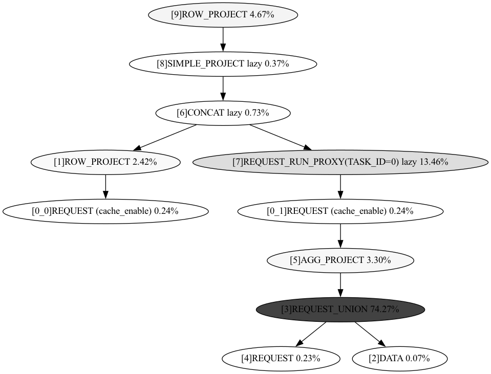
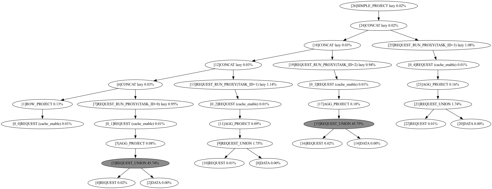
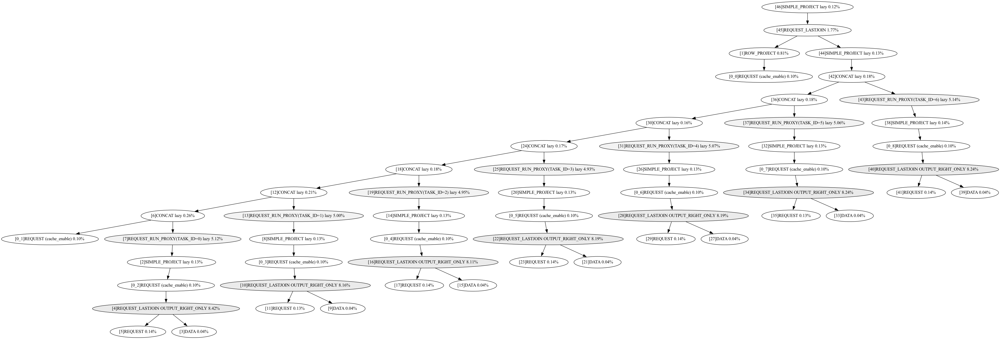
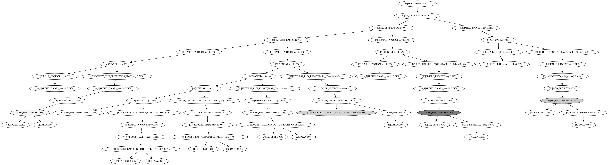

# Query Plan

Here we show the query plan of OpenMLDB for Q0-5. The percentage in each node refers to the time consumption of the node.

## 1. Q0

You can see the detailed query from [here](https://github.com/decis-bench/febench/blob/main/OpenMLDB/fequery/Q0/Q0_deploy_benchmark.sql).

The features (output columns) in the query Q0 include three parts: (i) all the origin table columns (basic features);(ii) aggregation features separately from two time windows (e.g.,  distinct counts of "pickup\_latitude" in last 1/2 hour); (iii) aggregation features computed across different time windows (e.g., the division of the 1h/2h window features). Since there is only one base table, Q0 is limited to  fundamental RTFE operators (e.g., aggregations), and windows over the same table.

## 2. Q1

You can see the detailed query from [here](https://github.com/decis-bench/febench/blob/main/OpenMLDB/fequery/Q1/Q1_deploy_benchmark.sql).

First, different from Q0, the query Q1 involves more window operators. The reason is that Q1 contains much fewer basic features (6 table columns) and it is vital to derive effective new features to support accurate forecast. Second, Q1 involves 10 different sizes of time windows. The query plan is more complicated than Q0.

## 3. Q2

You can see the detailed query from [here](https://github.com/decis-bench/febench/blob/main/OpenMLDB/fequery/Q2/Q2_deploy_benchmark.sql).

In the query Q2, joint features are computed from multiple tables (e.g., features of nearby farms and recent hours) by conducting the last join operator on 7 farm tables and 1 training table, providing a useful test for online one-to-one joining performance. Interestingly, Q2 mainly extracts temporal features (e.g., the last distinct values of timestamp features), which is different from other queries that involve a large number of aggregations on numeric columns. Note that Q2 does not contain time windows, so all the historical tuples could contribute to the feature computation with incoming tuples, which is markedly different from traditional stream cases.

## 4. Q3

You can see the detailed query from [here](https://github.com/decis-bench/febench/blob/main/OpenMLDB/fequery/Q3/Q3_deploy_benchmark.sql).

For the query Q3, it involves 113 RTFE operators and 15GB batch data, most of which are aggregations over joined window tables. Besides, different from above templates (Q0−Q2), (i) Q3 performs set conjunction operators (e.g., unions) over two data streams, since multiple tables in Q3 have some of the same feature columns; (ii) 𝑄3 has up to 6-level subqueries that include both the whole tables (e.g., all tuples in ’product_item’) and tables over time windows (e.g., sales within a 10-hour period). These types of subqueries can be costly to process due to the large amount of data involved and the computational overhead required for aggregating data over different time windows. Thus, 𝑄3 is useful to test the performance of complex subquery processing