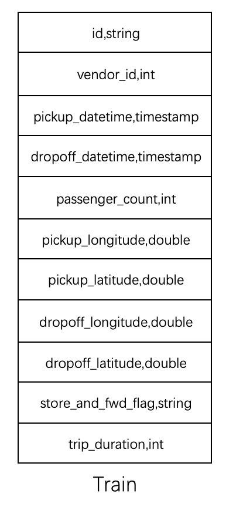
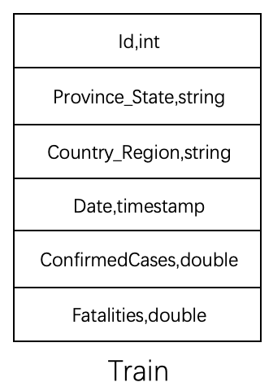
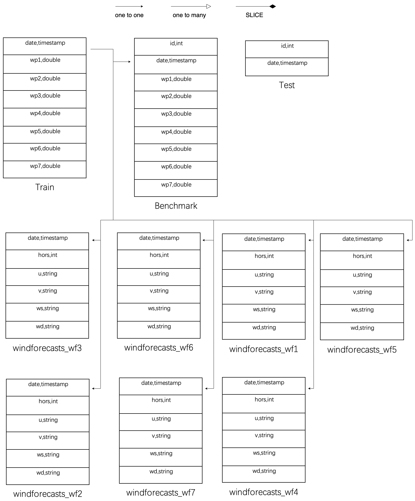
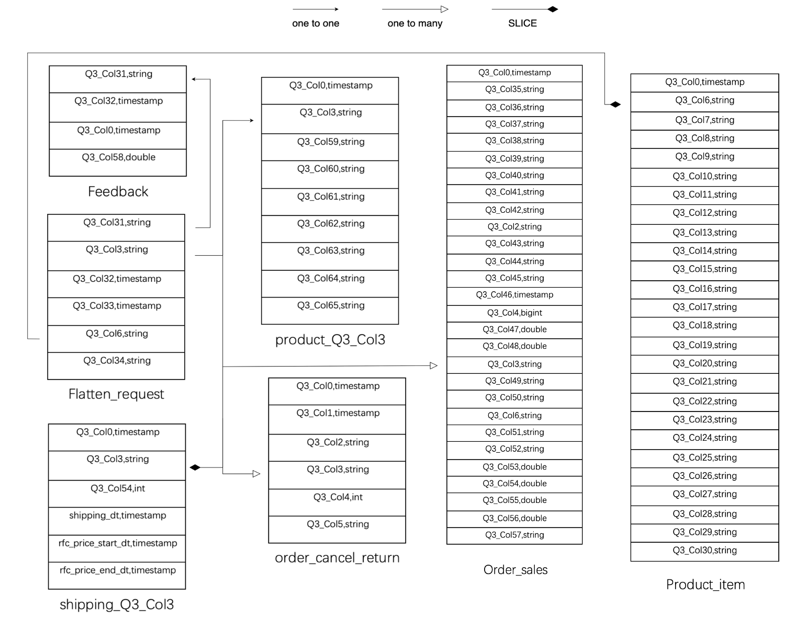
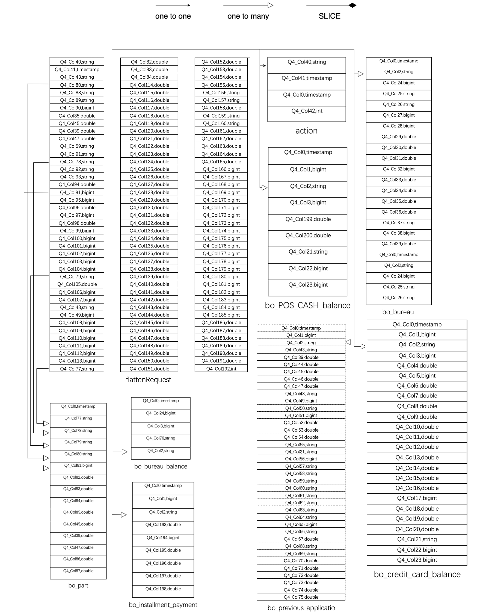
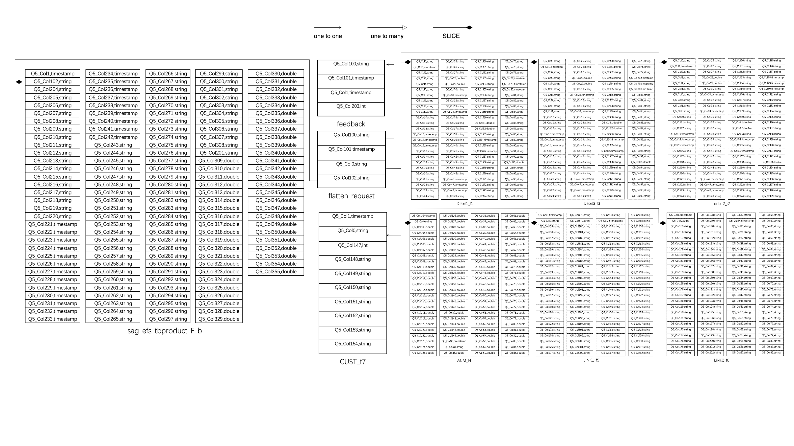

# Data Schema

## 1. Q0

For the ride prediction task, we collect open NYC transportation data ranging from 2016-01-01 to 2016-06-30. 

The schema of the corresponding table is presented below, consisting of a singular table with a total of eleven columns, comprising two timestamp columns, two string columns, and seven numeric columns.

  
## 2. Q1

For the flu forecast task, we have collected covid19 data ranging from  2020-01-22 to 2020-04-07.

The corresponding table schema is presented below, comprising a singular base table with a total of six columns, consisting of one timestamp column, two string columns, and three numeric columns.

## 3. Q2

For the power forecast task, we have collected the open wind-power data ranging from  2009-07-01 to 2012-06-26. 

The table schema is shown below. It consists of 10 tables containing a total of 61 columns. Among them, seven farm tables record power changes separately for each farm, while the remaining three training tables are utilized for the prediction model training process.

## 4. Q3

For the sales-prediction task, we have collected real data in Uniqlo ranging from  2017-12-31 to 2021-05-30. 

The data schema comprises a total of 7 tables with 85 columns, incorporating both steam tables, such as canceled orders storage, and attribute tables, such as product information.

## 5. Q4

The task aims to predict whether customers will pay back their loans on time for a credit card company. Q4 owns 9 tables together with 1GB data and 245 columns. The schema is shown below.

## 6. Q5

Q5 owns 10 tables with over 13GB origin data and 773 columns. The schema is shown below.

